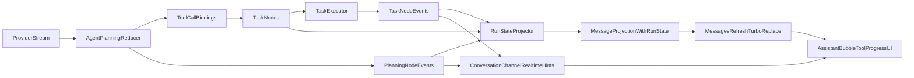

# Tool Progress Contract Design

## Summary

This design defines a breaking-but-clean redesign for real-time tool progress in Cybros.

The target shape is:

- `task` / tool execution becomes a first-class durable execution model
- the default chat UI still centers on the parent `agent_message` bubble
- the running bubble renders a structured `run_state` projection derived from durable execution truth
- realtime delivery accelerates the UI, but refresh/reconnect correctness comes from server-side projection, not from having seen every event

This is intentionally more invasive than a narrow patch. The goal is to remove the current split between provider-side live tool events, internal task nodes, and frontend-visible progress text.

## Status

This design should be treated as a **next-step architecture draft**, not as implementation-ready work.

Recommended sequencing:

1. finish the `Conversation Input Policies` implementation
2. freeze the resulting turn/transcript/supersession semantics
3. then revise and implement this tool-progress redesign against the landed code

The purpose of this document today is to:

- lock the target direction
- record the boundaries that must remain clean
- record the unresolved questions that should be revisited after input-policies land

## Goals

- Make tool execution a first-class durable domain concept instead of a semi-hidden implementation detail.
- Support a future “real-time tool progress” UI without relying on brittle provider-specific event semantics.
- Ensure refresh, reconnect, missed cable delivery, and terminal convergence all remain truthful.
- Keep the default user-facing transcript centered on `agent_message` bubbles rather than exposing raw execution internals by default.
- Replace generic text-only progress behavior with structured execution state.

## Non-goals

- Make every `task` node a default standalone transcript row for end users in the first pass.
- Preserve current `progress/log` cable payload shapes for compatibility.
- Preserve current conversation message projection structure where it blocks a cleaner contract.
- Solve every long-term execution UX surface now, such as separate ops timelines, execution dashboards, or cross-conversation tooling.

## Current Problem

Today the system already has three partial layers of tool progress:

1. **Provider-side planning stream**
   - `ToolCallStart`
   - `ToolCallDelta`
   - `ToolCallEnd`
   - emitted in [cybros/lib/agent_core/stream_event.rb](cybros/lib/agent_core/stream_event.rb)
   - normalized by [cybros/lib/agent_core/resources/provider/simple_inference_provider.rb](cybros/lib/agent_core/resources/provider/simple_inference_provider.rb)

2. **Durable internal execution truth**
   - `task` nodes created during tool-loop expansion
   - task input/output persisted in DAG
   - execution state transitions handled in [cybros/lib/agent_core/dag/executors/task_executor.rb](cybros/lib/agent_core/dag/executors/task_executor.rb)

3. **Frontend-visible running state**
   - a single hidden progress line in [cybros/app/views/conversation_messages/_message.html.erb](cybros/app/views/conversation_messages/_message.html.erb)
   - generic `progress/log` text handling in [cybros/app/javascript/controllers/conversation_channel_controller.js](cybros/app/javascript/controllers/conversation_channel_controller.js)

These three layers are not one coherent contract. The current UI can display streamed assistant text, but not structured tool execution progress that survives refresh/reconnect truthfully.

## Design Principle 1: Treat task execution as first-class durable truth

The system should stop thinking about tool execution as something that only exists “inside the agent loop.”

Instead:

- a tool call creates or maps to a durable execution object
- execution state changes are represented durably
- the parent `agent_message` bubble is a projection over that execution subtree

The cleanest durable source of truth is still the DAG:

- parent `agent_message`
- descendant `task` nodes
- durable node events

We should avoid inventing a second hidden store when the DAG can already express causal execution.

## Design Principle 2: The parent assistant bubble is a projection, not the source of truth

The default user experience should remain a single assistant bubble for the turn.

That bubble should not own live tool state. It should render a server-side projection that is computed from:

- the parent `agent_message`
- descendant `task` nodes
- durable execution events
- approval / repair / resolution state

This gives us two benefits:

- **durability**: the same snapshot can be re-rendered via `messages/refresh`
- **freedom to evolve internals**: provider wire formats and executor details do not leak into frontend truth

## Design Principle 3: Planning and execution are different phases

Tool progress is not one thing.

There are at least two distinct phases:

- **planning**
  - model decides that tool calls should exist
  - ids, names, and arguments are stabilized
- **execution**
  - task nodes are queued, approved, run, finished, or errored

The contract should model these explicitly rather than squeezing both into one generic text message.

Recommended phases:

- `planning`
- `authorization`
- `execution`
- `completed`

## Chosen Direction: Hybrid, task-first, projected UI

We already chose:

- **UX**: hybrid
- **surface compatibility**: break freely

For that combination, the best architecture is:

- `task` nodes are first-class internal durable execution objects
- the default chat transcript still shows a single assistant bubble per turn
- that bubble projects current tool execution state from the DAG
- structured realtime events can accelerate the UI, but are not the only truth path

This is better than:

- exposing provider raw events directly
- keeping tool execution hidden and mirroring it ad hoc into the bubble
- relying on append-only event logs as the primary UX state

## Boundary With Conversation Input Policies

This design depends on `Conversation Input Policies`, but it should remain orthogonal to it.

### Assistant bubble state vs composer state

`run_state` should remain **assistant-bubble state**, not a generic conversation/composer status object.

The intended split is:

- `agent_message.run_state`
  - assistant-owned planning, approval, and tool execution
  - terminal convergence for the assistant bubble
- conversation/composer state
  - queue indicators
  - candidate next input
  - steer hints / mode
  - other pre-turn product-policy state

That keeps the future queue/steer composer rail separate from assistant execution state.

### Preflight tasks are out of scope for `run_state`

The input-policies design introduces pre-assistant tasks such as:

- `task(compress_input)`
- `task(compact_context)`

These should **not** be part of the first `agent_message.run_state` contract.

They are:

- policy-driven preflight work
- closer to composer / conversation state than assistant execution state
- likely to be shown near the composer rather than inside the running assistant bubble

If we later want a broader “turn execution state” contract, that should be a separate decision.

### Superseded / interrupted turns are a prerequisite

This design should not define final replay/refresh behavior for:

- interrupted assistant nodes
- superseded steer blocks
- hidden transcript versions

until `Conversation Input Policies` have frozen those semantics.

## Canonical Durable Truth

One design choice should be fixed now:

- tool planning / binding truth should be canonical on the **task side**
- the parent assistant bubble should only render a projection of that truth

Recommended canonical sources:

- `task.body.input`
  - stable `tool_call_id`
  - bound `task_node_id`
  - resolved tool identity
  - safe argument previews
- task node state
  - queued / running / finished / errored / rejected / skipped
- task body output / output preview
  - durable execution result summary

Recommended non-canonical sources:

- parent `agent_message.metadata`
  - coarse summaries only
- durable node events
  - temporal facts and replay hints
- frontend local state
  - never authoritative

This keeps refresh/retry/replay deterministic and avoids inventing a second hidden state store on the parent bubble.

## Proposed Contract Shape

The app-facing message projection should grow a `run_state` field for running or recently-terminal assistant turns.

Suggested shape:

```json
{
  "node_id": "agent_node_id",
  "node_type": "agent_message",
  "state": "running",
  "payload": {
    "output_preview": { "content": "..." }
  },
  "run_state": {
    "status": "executing_tools",
    "phase_message": "Running tools...",
    "started_at": "2026-03-07T00:00:00Z",
    "updated_at": "2026-03-07T00:00:03Z",
    "summary": {
      "planned_count": 2,
      "running_count": 1,
      "finished_count": 0,
      "errored_count": 0,
      "latest_message": "Running memory_search..."
    },
    "tools": [
      {
        "tool_call_id": "call_1",
        "task_node_id": "task_uuid",
        "name": "memory_search",
        "state": "running",
        "phase": "execution",
        "arguments_preview": "{\"query\":\"...\"}",
        "output_preview": null,
        "error": null,
        "started_at": "2026-03-07T00:00:02Z",
        "finished_at": null,
        "updated_at": "2026-03-07T00:00:03Z"
      }
    ]
  }
}
```

### `run_state.status`

Recommended values:

- `pending`
- `planning`
- `awaiting_approval`
- `executing_tools`
- `completed`
- `failed`
- `stopped`

### `tools[*].state`

Recommended values:

- `planned`
- `awaiting_approval`
- `queued`
- `running`
- `finished`
- `errored`
- `rejected`
- `skipped`

### `tools[*].phase`

Recommended values:

- `planning`
- `authorization`
- `execution`
- `completed`

## Event Contract

The current generic `progress/log` event kinds should not remain the primary contract for tool progress.

Introduce dedicated structured kinds such as:

- `tool_planned`
- `tool_bound`
- `tool_started`
- `tool_updated`
- `tool_finished`
- `tool_failed`
- `tool_authorization_required`
- optional `run_state_snapshot`

These events should carry structured payloads, not rely on `event.text`.

The frontend may still use them as low-latency hints, but the server must always be able to reconstruct the same state through projection and refresh.

## Backend Shape

### Agent planning reducer

When the model produces tool calls:

- stabilize `tool_call_id`, name, and arguments
- bind tool-call planning state to the parent `agent_message`
- create durable descendant `task` nodes
- record `tool_call_id -> task_node_id`

This should happen in or near:

- [cybros/lib/agent_core/dag/executors/agent_message_executor.rb](cybros/lib/agent_core/dag/executors/agent_message_executor.rb)

### Task execution truth

When a task node executes:

- its node state becomes durable execution truth
- its output preview / final output become durable truth
- structured execution events become replayable

This should happen in or near:

- [cybros/lib/agent_core/dag/executors/task_executor.rb](cybros/lib/agent_core/dag/executors/task_executor.rb)
- [cybros/lib/dag/node_event_stream.rb](cybros/lib/dag/node_event_stream.rb)

### Run-state projector

Add a projector that derives the parent bubble’s `run_state` from:

- agent node state
- descendant task node states
- task outputs / previews
- durable task-related node events
- authorization / repair / resolution metadata

Natural homes:

- [cybros/lib/dag/transcript_projection.rb](cybros/lib/dag/transcript_projection.rb)
- [cybros/app/models/conversation.rb](cybros/app/models/conversation.rb)

## Frontend Shape

The frontend should continue to treat `message_<node_id>` as the durable UI unit.

The running assistant bubble should evolve from:

- one hidden `progress` line

into:

- a compact top-level run summary
- an expandable or inline list of tool progress entries
- optional latest log / latest message line
- final terminal collapse into standard assistant output

This should happen in:

- [cybros/app/views/conversation_messages/_message.html.erb](cybros/app/views/conversation_messages/_message.html.erb)
- [cybros/app/javascript/controllers/conversation_channel_controller.js](cybros/app/javascript/controllers/conversation_channel_controller.js)

The frontend should not have to reconstruct truth from raw provider events.

## Refresh and Replay Rules

The new contract must satisfy:

- refresh without prior cable history
- reconnect after missed cable events
- replay after partial event delivery
- terminal convergence after final Turbo replace

That implies:

- `Conversation#message_for_node_id` must be able to rebuild current `run_state`
- `messages/refresh` must return the same visible tool state
- node-event replay may improve latency, but must not be the only source of truth

### Replay identity

The default replay/refresh identity should remain **assistant-bubble scoped**:

- the parent `agent_message` remains the visible truth unit
- descendant `task` nodes feed the parent projection
- realtime hints may be task-aware internally, but the primary UI contract remains the parent bubble

If we later want a richer developer execution timeline, that should be a separate surface with a different replay identity.

## Why not expose task rows directly by default?

Because the default chat surface should still read like an assistant turn, not like a raw internal scheduler trace.

However, making task execution first-class internally gives us optional future surfaces:

- collapsible “tool activity” section inside the bubble
- developer-mode timeline
- per-task inspect / retry / audit tools
- richer approval and error diagnostics

This is why the hybrid approach is stronger than both:

- hiding tasks completely
- forcing tasks into the main transcript by default

## Breaking Changes We Should Accept

- change app-facing message projection
- change channel payload semantics
- stop relying on `progress/log` as the main running-state channel
- add a richer running-state block to the message partial
- treat task execution as durable projection input, not a hidden side effect

These are acceptable because the current contract is already too weak for the target UX.

## Target Data Flow



## File-Level Implications

### Backend execution and persistence

- [cybros/lib/agent_core/dag/executors/agent_message_executor.rb](cybros/lib/agent_core/dag/executors/agent_message_executor.rb)
- [cybros/lib/agent_core/dag/executors/task_executor.rb](cybros/lib/agent_core/dag/executors/task_executor.rb)
- [cybros/lib/dag/node_event_stream.rb](cybros/lib/dag/node_event_stream.rb)
- [cybros/app/models/messages/task.rb](cybros/app/models/messages/task.rb)

### Projection and app-facing read APIs

- [cybros/lib/dag/transcript_projection.rb](cybros/lib/dag/transcript_projection.rb)
- [cybros/app/models/conversation.rb](cybros/app/models/conversation.rb)

### Realtime transport and UI

- [cybros/app/channels/conversation_channel.rb](cybros/app/channels/conversation_channel.rb)
- [cybros/app/javascript/controllers/conversation_channel_controller.js](cybros/app/javascript/controllers/conversation_channel_controller.js)
- [cybros/app/views/conversation_messages/_message.html.erb](cybros/app/views/conversation_messages/_message.html.erb)

## Risks and Trade-offs

- This is a real contract reset, not a local patch.
- Some existing replay assumptions may need to be rethought for structured event volume.
- More truth will move into projection code, which increases projector complexity but reduces UI hacks.
- Provider-specific details must remain internal or the contract will become brittle again.

## First-Pass Scope Guardrails

The first implementation should explicitly support lifecycle milestones:

- `planned`
- `awaiting_approval`
- `queued`
- `running`
- `finished`
- `errored`
- `rejected`
- `skipped`

The first implementation should **not** assume that we already have a perfect mid-tool progress/log API inside task execution.

If task execution still only exposes milestone transitions, the first pass should stay milestone-oriented rather than inventing fake fine-grained percentages or logs.

## Open Questions To Revisit After Input Policies Land

1. Should `run_state` remain strictly assistant-bubble scoped forever, or eventually become part of a broader turn-level execution contract?
2. What exactly should `messages/refresh` return for interrupted/superseded/hidden assistant nodes?
3. What replay invalidation rule should apply when stale node events arrive after `interrupt_new_turn` or `steer_current_turn`?
4. What retention/coalescing/indexing rules do structured `tool_*` events need?
5. Which fields require explicit redaction/truncation rules by default (`arguments_preview`, `output_preview`, logs)?

## Future Extensions

Once the task-first hybrid model exists, we can add later without re-architecting:

- collapsible per-tool logs
- developer-mode execution timeline
- richer approval UIs
- per-task retry / inspect controls
- separate ops/debug views built from the same durable task truth
