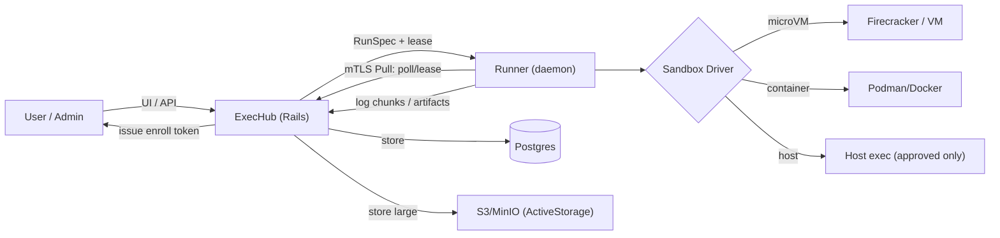
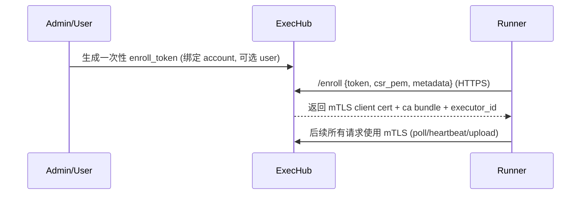

# Cybros Execution Subsystem（ExecHub + Runner）设计方案

> 目标：为 Cybros 提供“在本地/远程主机的隔离环境中执行操作（编辑修改文件、运行命令、收集信息）”的基础设施。
>
> 要求：默认安全（deny-by-default）、强审计、可多租户隔离、可在内网/NAT 下可靠工作、并且可以先独立发展（不依赖 AgentCore/产品交互），最后再集成。

---

## 0. 范围与原则

### 0.1 设计原则

- **控制面与执行面分离**：ExecHub 负责编排、策略、审计；Runner 负责实际执行与隔离落地。
- **Pull 优先**：Runner 主动向控制面拉取任务，避免在用户机器开放入站端口（天然适配 NAT/企业内网）。
- **Deny-by-default**：默认不允许网络/宿主 IO/敏感 env；一切能力由 policy 显式授予。
- **“用户决定是否信任本机”是一等概念**：执行 profile 分层，不可信默认强隔离；可信才允许更便捷/更高性能的模式。
- **易用与安全平衡**：把“安全做法做得更省事”（一键允许域名并重试、模板 allowlist），避免用户因复杂而绕过检查。
- **结果可回放**：每次执行产出命令/权限/镜像/摘要/文件变更（diff）/工件索引，可审计、可重跑。
- **先独立、后集成**：先以独立子系统（ExecHub API + Runner）落地；与 AgentCore / DAG 节点映射与 UI 集成放在最后阶段。

### 0.2 非目标（第一阶段不做）

- 不做交互式 PTY（ssh-like shell）。只做非交互命令 + 结构化文件读写/补丁。
- 不做“自动信任推断”。信任必须由用户/管理员显式设置或审批。
- 不承诺在“完全不可信的宿主机（Runner 被攻陷）”下保护所有租户数据：Runner 属于执行面信任边界的一部分（见威胁模型）。

---

## 1. 需求清单（功能点）

### 1.1 核心能力

- 在 **Linux（优先）** 与 **macOS（可选）** 的目标机器上执行：
  - 运行命令（可配置超时、资源限制）。
  - 读/写 workspace 内文件；应用 patch；产出 diff。
  - 收集工件（测试报告、日志、生成文件、截图等）。
- Workspace **需要持久化**（跨多次 run/多轮对话），并且必须可锁定防并发写冲突。
- 必须支持 **不可信代码**：
  - 默认不可信：必须在强隔离环境执行（microVM/VM）。
  - 用户可选择标记“可信环境”获得更好性能/更低延迟（容器/宿主）。
- 网络访问支持 **policy 三档**：
  - 全禁 `none`
  - 白名单 `allowlist`
  - 不限制 `unrestricted`
- Cybros 与主机之间的连接必须 **安全**：
  - 认证（防伪装 Runner/控制面）
  - 加密（防窃听）
  - 最小权限（短期凭证、可撤销）
- 多租户隔离：至少按 **account（租户）** 与 **user（用户）** 做隔离边界，支持未来形态（单用户/单租户多用户/多租户）。

### 1.2 运维与可靠性

- NAT/内网/企业代理场景可用：
  - Runner 只需出站访问控制面（Pull）。
  - 支持 Runner 通过 HTTP(S) 代理访问控制面。
  - 对“控制面在本地开发机、外部机器要连接”的场景给出清晰方案（隧道/VPN/Relay）。
- 任务调度与容错：
  - lease/心跳机制，Runner 掉线可回收并重派。
  - 幂等：日志/工件上传可重试不重复。
  - 取消：用户可取消正在执行的 run（Runner 负责终止沙箱）。
- 可观测性：
  - 流式日志（chunked），并且有大小上限与截断标记。
  - 审计事件（谁批准/谁触发/跑了什么/访问了哪些资源）。

---

## 2. 威胁模型（Threat Model）

### 2.1 主要威胁

- 不可信代码试图：
  - 逃逸沙箱获取宿主权限（container escape / kernel exploit）。
  - 读取宿主敏感文件（SSH key、云凭据、/etc、home）。
  - 通过网络外传 secrets/隐私数据。
  - 资源消耗攻击（fork bomb、磁盘打满、日志洪泛）。
- LLM/提示注入导致：
  - 误执行高危命令（rm -rf、curl|bash）。
  - 放宽权限（网络 unrestricted、宿主读写）而用户未充分理解。
- Runner 端被攻陷：
  - 伪造执行结果、伪造日志。
  - 窃取同机的其他租户 workspace（如果共存且隔离不足）。

### 2.2 核心防线

- **分级信任 + 强隔离默认**：不可信默认 microVM/VM；容器仅用于可信；宿主仅用于显式审批。
- **最小可用权限**：默认 `NET=NONE`、只挂载 workspace；secrets 以短期 token 注入且可审计。
- **强制网络出口控制**：Untrusted 模式下通过“只允许访问 egress proxy + allowlist”实现硬限制。
- **资源限制**：CPU/内存/磁盘/时间/最大输出。
- **审计与可撤销**：每次放宽权限都落审计，可撤销 runner 证书/禁用 executor。

---

## 3. 总体架构

### 3.1 组件

- **ExecHub（控制面子系统，位于 Cybros Monolith 内部）**
  - API：Runner 注册/心跳、任务派发、日志/工件接收、workspace/run/policy 管理。
  - 调度：按 labels/capacity 选择 executor；对 workspace 做亲和性调度。
  - 存储：Postgres（元数据/状态），对象存储（工件/大日志，ActiveStorage）。
  - 鉴权：Runner=mTLS；用户=现有 Session（或后续扩展为 API token）。

- **Runner（执行面守护进程）**
  - 拉取任务（Pull），拿 lease，执行，上传结果。
  - 管理 workspace（创建/锁/清理/配额）。
  - 选择 sandbox driver 执行：microVM / container / host。
  - 执行网络策略：none/allowlist/unrestricted（Untrusted 必须硬限制）。

### 3.2 数据面/控制面示意（Mermaid）



### 3.3 Monolith 组织方式（独立模块/namespace）

ExecHub 以“强边界的内部模块”落在同一 Rails app 内：

- Ruby namespace：`Cybros::ExecHub`（或 `Cybros::Execution`，二选一即可；本文统一称 ExecHub）。
- Rails 分层建议：
  - `app/models/exechub/*`（Executor/Workspace/Run/Policy/Approval/Telemetry 等）
  - `app/controllers/exechub/*`（用户 UI + 管理 API）
  - `app/controllers/exechub/runner_api/*`（Runner 专用 API）
  - `app/jobs/exechub/*`（调度、超时、lease 回收、清理、轮换证书等）
  - `lib/exechub/*`（协议、策略引擎、校验器、Sandbox driver 抽象）
- 与 AgentCore 的依赖：
  - 第一阶段 **不依赖** AgentCore。
  - 最后集成时只增加适配层，把 AgentCore 的 tool calls 转换为 RunSpec / ExecHub API 调用（见第 12 节）。

### 3.4 Runner API 的“多租户路径前缀”兼容

如果 Cybros 采用 URL path-based multi-tenancy（`/{account_id}/...`），Runner API 建议放在 **不需要 account 前缀**的全局路径下，并在多租户 middleware 中白名单跳过，例如：

- `POST /_system/exechub/api/v1/...`

理由：
- Runner 通过 mTLS 身份可直接映射到 `executor_id`（再映射到 `account_id`），无需在 URL 中携带租户信息。
- 避免 Runner 需要感知 `external_account_id`，减少配置复杂度与错误率。

---

## 4. 关键概念与数据模型（ExecHub 子系统）

> ExecHub 在 Monolith 内复用 Cybros 的 `Account/User/Role` 与多租户机制；从第一天起，所有 ExecHub 表都按 `account_id`（必要时再加 `user_id`）做硬隔离，避免将来迁移成本爆炸。

### 4.1 Executor（执行节点）

- 表：`exechub_executors`
- 字段建议：
  - `id`（UUIDv7）
  - `account_id`（共享池场景才允许 NULL；默认要求归属租户）
  - `name`
  - `labels`（jsonb，例如 `{"os":"linux","arch":"amd64","sandbox":["microvm","container"]}`）
  - `capacity`（jsonb，最大并发、CPU/内存上限）
  - `status`（online/offline/draining/disabled）
  - `last_heartbeat_at`
  - `client_cert_fingerprint`（mTLS 身份）

### 4.2 Workspace（持久工作区）

- 表：`exechub_workspaces`
- 字段建议：
  - `id`
  - `account_id`
  - `user_id`（可选：个人工作区）
  - `executor_id`（当前驻留 executor）
  - `kind`（`repo` / `empty` / `imported_path`）
  - `root_handle`（opaque；控制面不直接存物理路径）
  - `size_bytes`（统计值）
  - `locked_by_run_id`（互斥）
  - `retention_policy`（TTL、自动归档/清理）

### 4.3 Run（一次执行）

- 表：`exechub_runs`
- 字段建议：
  - `id`
  - `account_id`
  - `requested_by_user_id`
  - `approved_by_user_id`（可选）
  - `workspace_id`
  - `executor_id`
  - `state`：`queued` → `leased` → `running` → `succeeded|failed|canceled|timed_out`
  - `requested_capabilities`（见 policy）
  - `effective_capabilities`（最终生效能力，含审批结果）
  - `sandbox_profile`（untrusted/trusted/host）
  - `command`（数组形式 `["bash","-lc","..."]`）
  - `cwd`（默认 `/workspace`）
  - `env_allowlist` + `env_refs`（secrets 引用）
  - `timeout_seconds`
  - `limits`（cpu/mem/disk/max_output_bytes 等）
  - `exit_code`
  - `stdout_truncated` / `stderr_truncated`
  - `artifacts_manifest`（jsonb：对象存储 key、大小、hash）
  - `diff_blob`（ActiveStorage 引用）
  - `lease_expires_at` / `last_heartbeat_at`
  - `runner_version` / `sandbox_version`

### 4.4 Policy（策略）

- 表：`exechub_policies`
- 作用域（自上而下覆盖）：
  - global default → account → user → workspace → run override
- 内容（jsonb）：
  - `fs`：允许 read/write 的路径集合（默认仅 workspace）
  - `net`：none/allowlist/unrestricted + allowlist entries
  - `secrets`：可用 secret refs
  - `sandbox_profile_rules`：哪些条件下允许 trusted/host
  - `approval`：哪些能力需要人工审批

---

## 5. 执行 Profile（用户可理解的安全层级）

### 5.1 Untrusted（默认）

- 适用：未知仓库/未知脚本/来自用户输入的不可信代码。
- 目标：把逃逸风险降低到“需要突破 microVM/VM 边界”。
- Linux 推荐：
  - **Firecracker microVM**（KVM）作为沙箱边界。
  - workspace 通过 virtiofs/9p 挂载（只暴露 workspace）。
  - 网络强制通过 egress proxy（见第 7 节）。
- macOS 推荐：
  - Runner 启动 Linux VM（Lima/Virtualization.framework），在 VM 内执行（VM 是隔离边界）。

### 5.2 Trusted（显式标记）

- 适用：开发者自用、已知可信仓库、或用户明确允许“更弱隔离换更好体验”。
- Linux：
  - rootless Podman 优先（减少宿主权限暴露）。
  - 允许网络 allowlist/unrestricted（策略控制；但注意容器模式下“硬限制”能力较弱）。
- macOS：
  - 同样建议走 Linux VM 内容器，保证一致性；否则 Host 模式需更强审批。

### 5.3 Host（高危，仅显式审批）

- 适用：确实需要宿主能力（访问桌面/设备、企业 VPN 内资源等）。
- 约束：
  - 仅允许“个人 Runner（绑定 user）”开启。
  - **每次 run 必须审批**（展示命令、cwd、可读写路径、网络策略、secrets）。
  - 文件访问必须明确路径 allowlist（禁止 `~` 全量、禁止 `/`）。

---

## 6. Runner 注册与安全通道（mTLS + Pull）

### 6.1 为什么 Pull

- Runner 只需要出站访问 ExecHub（HTTPS），无需在企业内网机器开放端口。
- NAT/防火墙友好；断线重连简单；可统一限流与审计。

### 6.2 注册（Enrollment）流程



要点：
- enroll token **一次性**、短 TTL、可撤销。
- mTLS 客户端证书可轮换（Runner 定期刷新；控制面可吊销）。
- 推荐在 ExecHub 前置反向代理（Caddy/Nginx/Traefik）终止 TLS 并校验客户端证书；将 runner identity 以受信 header 传给 Rails（Rails 只信任来自本地代理的 header）。

### 6.3 Runner 与 ExecHub 的认证边界

- Runner 身份：由 mTLS 客户端证书唯一确定（映射到 `executor_id`）。
- 每个 Run 另发 **短期 run_token**（JWT，scope=run_id，TTL=分钟级）用于上传日志/工件，降低横向风险。

---

## 7. 网络访问控制（易用 + 可强制）

### 7.1 用户可理解的三档

- `NET=NONE`：默认，尤其是 Untrusted。
- `NET=ALLOWLIST`：推荐日常（域名 allowlist；默认仅 443，可选 80）。
- `NET=UNRESTRICTED`：强提示 + 显式确认；默认仅 Trusted/Host 允许（Untrusted 默认禁用或每次审批）。

### 7.2 实现策略：Egress Proxy + 强制走代理（Untrusted 必须硬限制）

核心目标：避免“设置了 allowlist 但实际上可以绕过”的假安全。

推荐做法：
- Runner 同机启动 **Egress Proxy**（支持 HTTP + CONNECT 即可，不需要 MITM 解密）。
- Untrusted（microVM/VM）沙箱的网络被强制限制为：
  - 仅允许访问：DNS（可选） + Egress Proxy
  - 禁止直连外网
- allowlist 校验在代理侧完成：
  - HTTP：校验 `Host`
  - HTTPS：校验 CONNECT 的目标 host + SNI（可选）

说明：
- Trusted（rootless 容器）下对“每个容器”做硬 egress 限制往往需要更高权限与更复杂的网络栈（iptables/CNI）。第一阶段建议把 **硬限制保证** 放在 Untrusted；Trusted 以“默认配置代理 + 软限制 + 审计提示”满足易用。

### 7.3 allowlist 的 UX（避免用户关闭安全）

- 拦截时 Runner 返回结构化错误：`blocked_domains: ["api.github.com", ...]`。
- ExecHub UI 提供“一键加入 allowlist 并重试”：
  - `仅本次允许` 或 `对该 workspace 永久允许`
- 提供常用模板按钮：GitHub/GitLab/rubygems/npm/PyPI 等（按项目类型勾选）。
- 默认禁止直连 IP（需要高级选项显式允许）。

### 7.4 内网/企业网络

- allowlist 支持内部域名（`*.corp`）与私网段（高级）。
- DNS：microVM/VM 使用宿主 DNS（或企业 DNS），但要防止 DNS 成为绕过通道：
  - Untrusted 下可限制为固定 resolver（宿主 stub）+ 仅 UDP/TCP 53。
  - 或让 proxy 负责解析（proxy 侧解析并校验）。

---

## 8. 文件系统与本地 IO 控制（Deno 风格）

### 8.1 默认规则

- 沙箱内只挂载 workspace（读写）。
- 其他宿主路径默认不可见。
- `read_file/list_dir/apply_patch` 等操作必须在 workspace 范围内（realpath 校验，防 symlink 逃逸）。

### 8.2 扩展读取（Host / Trusted 可选）

当用户需要访问“本机文档/下载目录/企业共享盘”时：
- 只能在 `Trusted` 或 `Host` profile 下启用。
- 必须显式配置路径 allowlist：
  - `read_paths`: ["/Users/alice/Documents/ProjectX"]（macOS）
  - `write_paths`: 限制更严格，尽量只允许 workspace 或特定输出目录
- 审批 UI 必须展示这些路径。

### 8.3 Patch 优先（可审计）

建议把“编辑文件”统一表达为：
- `apply_patch(patch)`（git apply 兼容格式或自研安全 patch 格式）
并在执行后强制产出 `git diff`（或目录 diff）作为工件，便于审计与回滚。

---

## 9. RunSpec 协议（控制面与 Runner 的契约）

> 目标：让 ExecHub 与 Runner 可独立演进；将来接入 AgentCore 只需生成 RunSpec。

### 9.1 RunSpec（示例）

```json
{
  "run_id": "01J...base36",
  "workspace": { "id": "01J...", "mount": "/workspace" },
  "sandbox_profile": "untrusted",
  "command": ["bash", "-lc", "bundle exec rails test"],
  "cwd": "/workspace",
  "timeout_seconds": 900,
  "limits": { "cpu": 2, "memory_mb": 4096, "disk_mb": 20480, "max_output_bytes": 2000000 },
  "capabilities": {
    "fs": { "read": ["workspace:**"], "write": ["workspace:**"] },
    "net": { "mode": "allowlist", "allow": ["rubygems.org:443", "github.com:443"] },
    "env": { "allow": ["RAILS_ENV"], "secrets": ["secretref:github_token"] }
  },
  "artifacts": {
    "collect": ["tmp/test-reports/**", "log/test.log"],
    "always_diff": true
  }
}
```

### 9.2 状态与幂等

- Runner 领取任务：`lease(run_id, executor_id, ttl)`
- Runner 上报：
  - `started`（包含 sandbox 版本、实际生效能力摘要）
  - `log_chunk(seq, stream, bytes)`（可重试；按 seq 去重）
  - `heartbeat(progress)`（续租）
  - `finished(exit_code, artifacts_manifest, diff_ref, truncated_flags)`
- ExecHub 保证：
  - `run_id` 幂等
  - `log_chunk` 去重（按 `(run_id, seq, stream)`）

---

## 10. 可靠性与边界情况（Checklist）

### 10.1 NAT/内网/穿透

**场景 A：控制面在云（推荐）**
- Runner 出站连云端：天然支持 NAT/内网。

**场景 B：控制面在企业内网**
- Runner 也在同内网：直连即可。
- Runner 在受限网络：配置企业 HTTP(S) 代理访问 ExecHub。

**场景 C：控制面在本地开发机（Docker Compose），Runner 在外部网络**
- 默认不可达（本地无公网入口）。
- 推荐方案（按易用排序）：
  1) Tailscale/Headscale（私有 VPN）：为控制面与 Runner 建立同一 overlay 网络。
  2) Cloudflare Tunnel / ngrok / frp：给本地控制面暴露临时公网入口。
  3) 未来可选：官方 Relay 服务（双向出站 WebSocket，中继转发）。

### 10.2 Runner 掉线/重启

- lease 到期自动回收，run 回到 `queued` 或 `retryable_failed`。
- Runner 重启后可以继续上传未完成的 log chunks（按 seq 幂等）。

### 10.3 大日志/无限输出

- `max_output_bytes` 硬上限，超限截断并在 `finished` 标记 `stdout_truncated/stderr_truncated`。
- UI 只展示尾部 + 提供下载完整（若已保存到对象存储）。

### 10.4 磁盘打满

- workspace 配额（soft/hard）。
- run 临时目录独立配额。
- 超限时终止 run 并标记 `failed(disk_quota_exceeded)`。

### 10.5 并发写冲突

- workspace 级互斥锁：同一 workspace 同时只允许一个 `running` run。
- 支持 “只读 run”（例如索引/扫描）以共享并发（后续增强）。

### 10.6 时钟漂移

- lease/TTL 以服务端时间为准；Runner 上报仅作为建议。

### 10.7 Secrets 泄漏

- secrets 只以引用下发（Runner 去 secrets provider 换取短期值），并做输出 redaction（关键字/格式匹配）。
- 禁止将 secrets 写入工件（可做扫描，至少在 UI 明示风险）。

### 10.8 “软限制”提示（Trusted 容器网络）

- 当处于 Trusted 且网络仅靠 proxy/env 控制时，UI 必须标识：
  - “该模式下网络限制可能被绕过（可信环境）”
  - 引导用户在 Untrusted 模式运行不可信代码。

---

## 11. 部署形态（先独立发展）

### 11.1 单机（最低延迟）

- ExecHub（Rails）跑在同一台机器（可 Docker Compose）。
- Runner **建议以宿主机 systemd 服务**运行（便于使用 KVM、管理网络/防火墙、挂载磁盘）。
- microVM/容器也在该宿主机上执行，延迟最低。

### 11.2 分布式（多机器）

- ExecHub 统一部署（云或内网）。
- 多台机器安装 Runner（每台一个 executor）。
- workspace 亲和到某台 executor；需要迁移时做打包/同步（后续增强）。

### 11.3 仓库内 Runner（简易版，便于不同步演进）

Runner 与 Cybros（ExecHub）进度可能不同步，建议在 Cybros 仓库根目录加入 `runner/`，满足两类目标：

- **产品级 Runner（可独立发布）**：将来可拆到独立仓库或打包为单二进制/安装包，但源代码先放在 `runner/` 便于联调。
- **Mini Runner（开发/回归用）**：提供一个“功能覆盖最小集合”的实现（通常仅 Trusted/Host），用于：
  - 快速联调 ExecHub API（enroll/poll/log/artifacts）
  - 做协议兼容性测试（contract tests）
  - 在没有 Firecracker/复杂网络限制的环境下也能推进主流程开发

注意：
- Mini Runner 必须在文档与启动时打印“仅用于开发”的警告；默认禁用 Untrusted/microVM。
- Runner 与 ExecHub 的协议应以 JSON schema/OpenAPI 固化，Mini Runner 以此做严格校验，避免两边默默 drift。

---

## 12. 与 Cybros / AgentCore 的集成（最后做）

### 12.1 集成边界

- AgentCore 只需生成 `RunSpec` 并提交给 ExecHub：
  - 工具调用：`exec`, `apply_patch`, `read_file`, `collect_artifact` 等映射到 RunSpec 或 ExecHub API。
- ExecHub 返回的 `RunResult` 写回 DAG 的 `task` 节点 metadata：
  - exit_code、stdout/stderr 摘要、truncated、diff artifact、artifacts list、effective capabilities。

### 12.2 集成顺序建议

1) ExecHub + Runner 独立可用（通过 UI/CLI 手动触发 run）。
2) AgentCore 增加一个 “ExecutionToolAdapter（HTTP client）”，把工具调用转发到 ExecHub。
3) 最后把权限审批 UI 与对话 UI（DAG）打通。

---

## 13. 可执行实施计划（里程碑）

> 以“可交付、可验收”为导向；每个里程碑结束都能跑通一条端到端链路。

### M0（1 周）：规格冻结 + 原型

- 输出：OpenAPI/JSON schema（RunSpec/RunResult/Policy）、数据模型草案、状态机与错误码表。
- 原型：ExecHub 提供 `create workspace`、`create run`、`list runs` 的最小 API（无沙箱，仅假执行）。
- 验收：可以用 curl/脚本创建 run，并看到状态流转。

### M1（2–3 周）：Runner MVP（Trusted 容器执行 + 持久 workspace）

- Runner：
  - enroll（token→证书）+ mTLS poll/lease
  - workspace 创建/锁
  - 在容器内执行命令（Podman/Docker），挂载 workspace
  - chunked 日志上传 + 退出码回传
  - 执行后自动产出 diff（git diff 或目录 diff）
  - 仓库内提供 `runner/`（含 Mini Runner）用于联调与协议回归
- ExecHub：
  - executor/runner 管理页面（最小）
  - runs 页面（看日志、下载 diff）
- 验收：在 Linux 上可完成“编辑/运行测试/收集工件”的完整循环（手动触发）。

### M2（2–4 周）：Policy 与审批（Deno 风格能力 + deny-by-default）

- Policy 引擎：global→account→user→workspace→run 覆盖；输出 effective capabilities。
- 审批流：当申请高危能力（NET=UNRESTRICTED、Host 模式、宿主路径挂载、secrets）时进入 awaiting_approval。
- UX：拦截网络时返回 blocked_domains，并支持“一键加入 allowlist 并重试”。
- 验收：默认 NET=NONE；用户通过审批/allowlist 才能出网；审计完整。

### M3（3–6 周）：Untrusted 强隔离（Linux microVM/VM）+ 强制网络出口

- Linux：
  - 接入 Firecracker（建议 Runner 内置 sandbox driver；必要时引入 Go/Rust sidecar 负责底层）
  - microVM 资源限制（vCPU/mem/disk）
  - 网络强制走 egress proxy（host firewall 仅允许到 proxy）
  - workspace 挂载（virtiofs/9p）+ realpath 校验
- macOS（可选并行）：
  - Runner 起 Linux VM（Lima），在 VM 内执行（先容器后强化）
- 验收：不可信 profile 下无法直连外网、无法访问宿主文件；allowlist 生效且可审计。

### M4（2–4 周）：多租户隔离与运维增强

- executor 归属租户/用户；调度硬约束。
- executor capability/tags（手动 + 自动探测）与基于标签的调度（见第 19 节）。
- Runner telemetry（心跳上报资源使用/健康状态）与基础监控页面（见第 21 节）。
- 环境配置/Provisioning 的“安全最小实现”（可选，见第 20 节）。
- workspace 配额/清理策略；draining/升级机制。
- 证书轮换/吊销；Runner 自动更新。
- 验收：多租户并行运行互不干扰；可撤销某台 runner 的访问权。

### M5（最后 1–2 周）：与 Cybros/AgentCore 集成

- 实现 `ExecutionToolAdapter`（HTTP client）与 DAG task 节点的结果写回。
- 把审批 UI 接入对话流程（可先跳转到 ExecHub 页面）。
- 验收：LLM 工具调用 → ExecHub 执行 → 结果回到 DAG 任务节点与消息中。

---

## 14. 待确认的实现选择（不影响总体设计，但影响工程路径）

1) Runner 实现语言：
   - Ruby：迭代快、与 Rails 同栈；但分发与底层沙箱（firecracker/iptables）可能更复杂。
   - Go/Rust：更适合做守护进程与 microVM/网络；分发简单（单二进制）。
   - 建议：ExecHub（Ruby/Rails）固定；Runner MVP 可 Ruby，microVM driver 视情况用 Go/Rust。
2) 对象存储：
   - 本地部署：MinIO（compose 一键）或本地磁盘（仅开发）。
   - 云部署：S3。
3) 网络强制策略范围：
   - Untrusted 必须硬限制（强制代理 + 防火墙）。
   - Trusted 初期可软限制（proxy/env）并在 UI 标注；后续再补 per-container 硬限制。

---

## 15. API 草案（HTTP/JSON，便于独立开发与联调）

> 说明：这里给的是“契约级别”的草案，便于 Runner 与 ExecHub 分工并行推进。
> 未来如果要换成 gRPC streaming，也应保持语义一致（尤其是 lease/幂等/日志分片）。

### 15.1 Enrollment / Executor

- `POST /_system/exechub/api/v1/enrollment_tokens`
  - 作用：管理员生成一次性 token（绑定 account，可选 user/labels）。
- `POST /_system/exechub/api/v1/runners/enroll`
  - 入参：`{enroll_token, csr_pem, metadata}`
  - 出参：`{executor_id, mtls_client_cert_pem, ca_bundle_pem, config}`

- `POST /_system/exechub/api/v1/runners/heartbeat`（mTLS）
  - 入参：`{executor_id, runner_version, labels, capacity, running_runs_count, telemetry?}`
  - 出参：`{server_time, config_overrides}`

### 15.2 Poll / Lease / Run lifecycle（Runner → ExecHub）

- `POST /_system/exechub/api/v1/runners/poll`（mTLS，长轮询）
  - 入参：`{executor_id, supported_sandbox_profiles, max_runs_to_claim}`
  - 出参（有任务）：`{runs:[RunSpec...], lease_ttl_seconds}`
  - 出参（无任务）：`{runs:[], retry_after_seconds}`

- `POST /_system/exechub/api/v1/runs/:id/started`（mTLS + run_token）
  - 入参：`{effective_capabilities_summary, sandbox_version, started_at}`

- `POST /_system/exechub/api/v1/runs/:id/heartbeat`（mTLS + run_token）
  - 入参：`{progress, last_output_seq, now}`
  - 作用：续租 + 进度上报。

- `POST /_system/exechub/api/v1/runs/:id/log_chunks`（mTLS + run_token）
  - 入参：`{stream:"stdout"|"stderr", seq:int, bytes:base64, truncated:false}`
  - 幂等：重复 `(run_id, stream, seq)` 必须安全。

- `POST /_system/exechub/api/v1/runs/:id/artifacts`（mTLS + run_token）
  - 入参：`{name, sha256, bytesize, content_type, upload_url?}`
  - 备注：大工件建议走“预签名直传”（S3/MinIO），ExecHub 只收 manifest。

- `POST /_system/exechub/api/v1/runs/:id/finished`（mTLS + run_token）
  - 入参：`{exit_code, status, stdout_truncated, stderr_truncated, artifacts_manifest, diff_artifact_ref, finished_at}`

### 15.3 用户/系统侧 API（提交任务，不依赖 Agent）

- `POST /exechub/api/v1/workspaces`
  - `{kind, init:{repo_url?, ref?, template?, import_path?}}`
  - 返回 `workspace_id`。

- `POST /exechub/api/v1/workspaces/:id/runs`
  - 入参：`{command, capabilities, sandbox_profile, timeout, limits, artifacts}`
  - 返回 `run_id`（如果需要审批则 state=awaiting_approval）。

- `POST /exechub/api/v1/runs/:id/approve` / `POST /exechub/api/v1/runs/:id/reject`
  - 作用：审批高危能力（Host、挂载宿主路径、NET=UNRESTRICTED、secrets 等）。

- `POST /exechub/api/v1/runs/:id/cancel`
  - 作用：请求 Runner 终止该 run（best-effort + 审计）。

### 15.4 版本协商（避免 Runner/ExecHub 升级互相踩）

- Runner `heartbeat` 上报 `runner_version` 与 `protocol_version`。
- ExecHub 下发 `min_supported_runner_version`，不满足则拒绝 lease 并提示升级。

---

## 16. 调度、隔离与资源模型（更细的边界）

### 16.1 调度原则（最小可用版）

- **硬约束**：
  - executor 必须属于同一 `account_id`（或共享池但仅限 Untrusted profile）。
  - executor labels 必须满足 run 的 profile/OS/arch 要求。
  - workspace 的 `executor_id` 绑定时，run 默认落在同一 executor（避免搬运）。
- **软约束**：
  - capacity：并发上限、CPU/内存余量。
  - 亲和：优先选择最近有该 workspace 缓存的 executor。
- **draining**：
  - executor 进入 `draining` 后不再分配新 run；当前 run 允许完成或超时回收。

### 16.2 Workspace 生命周期（创建/迁移/清理）

- 创建：
  - `empty`：创建空目录（适合办公自动化/脚本生成）。
  - `repo`：由 Runner 执行 clone（需要 NET allowlist + 凭据方案，建议后续迭代）。
  - `imported_path`：导入宿主路径（只允许 Trusted/Host + 审批 + 只读默认）。
- 清理：
  - 按 retention_policy（TTL/空间水位）自动归档/清理。
  - 归档：打包 workspace → 对象存储（可选），用于迁移或回滚。
- 迁移（后续增强）：
  - 当 executor 下线或需要扩容时，将归档包恢复到另一 executor。

### 16.3 资源限制的最低要求

- `timeout_seconds`：到时强制终止沙箱。
- `max_output_bytes`：日志硬上限，避免 DB/对象存储被刷爆。
- `cpu/memory`：
  - microVM：通过 VM 配置限制。
  - 容器：通过 cgroups（rootless 可能受限，需在可信模式下接受限制弱一些并提示）。
- `disk_mb`：
  - workspace 配额（目录配额/卷配额/项目配额），至少要能阻止“打满整盘”。

---

## 17. “不过度复杂但足够安全”的 UX 规则（避免用户绕过）

- 默认：`Untrusted + NET=NONE`，并解释原因（不可信代码常见风险）。
- 当工具调用被网络拦截时：
  - 不弹一堆术语，只给“被阻止的域名列表”+“一键允许并重试”。
  - allowlist 的范围选择只给两档：`仅本次` / `对该 workspace 永久`。
- 当请求高危能力（Host/宿主路径写/NET=UNRESTRICTED/secrets）时：
  - 强制审批（不能一键永久允许）。
  - 审批页只展示 5 件事：命令、cwd、可读写路径、网络模式、将注入的 secrets（名称，不显示值）。
  - 审批记录写审计事件，且可回看。

---

## 18. Runner 在 Monolith 仓库中的组织与演进策略

你已决定：
- ExecHub 必须作为 Cybros 内部模块/namespace（Monolith）。
- Runner 与 Cybros 进度可能不同步，但希望同仓库便于开发期联调。

推荐仓库布局（示例）：

- `runner/`
  - `runner/README.md`：安装、注册、运行方式（含“开发版警告”）。
  - `runner/mini/`：Mini Runner（开发/回归用，默认仅 Trusted/Host）。
  - `runner/daemon/`：产品级 Runner（目标：支持 Untrusted/microVM、强制网络出口等）。
  - `runner/protocol/`：协议契约（OpenAPI/JSON schema）与兼容性测试用例。

演进原则：
- **协议先行**：所有变更先更新 schema/OpenAPI，再更新 ExecHub 与 Runner。
- **兼容窗口**：ExecHub 保持 “N-1 Runner 兼容”（至少兼容上一个 minor 版本），Runner 也应能与新旧 ExecHub 协商（见第 15.4 节）。
- **Mini Runner 的职责边界**：
  - 用于 API 联调与回归；不追求强隔离、不默认允许 Untrusted。
  - 任何安全能力（microVM/egress 强制）必须在产品级 Runner 中实现并验证。

---

## 19. Executor capability / role / tags（主机能力标注与自动发现）

### 19.1 目标

- 让用户在“添加主机/环境”时能设置：
  - **角色**（role）：例如 `gpu`, `storage`, `office`, `home`, `ci`, `prod-like` 等。
  - **能力**（capability）：例如 `gpu=nvidia`, `cuda=12`, `ram_gb=64`。
- 让系统（Runner 或后续 Agent）能自动发现并回填能力标签，便于调度与决策。

### 19.2 重要边界（不要把 tags 当作强安全边界）

- capability/tags 主要用于 **调度与体验**，而不是单独作为安全边界：
  - 即使 executor 标记 `office`，仍需通过 network policy/审批控制内网访问。
  - 即使 executor 标记 `gpu`，也不能因此绕过 Untrusted 的隔离默认值。
- 来源需要区分并可审计：
  - `manual`：用户手动设置
  - `observed`：Runner 自动探测（例如读取系统信息/执行受控 probe）
  - `agent_suggested`：Agent 提议（必须用户确认后才落地为有效标签）

### 19.3 自动发现方式（不依赖 Agent，也不引入高风险）

从低风险开始：
- Runner 在 `heartbeat` 上报基础事实（facts）：
  - OS/arch/kernel、CPU 核数、内存/磁盘、容器运行时可用性
  - GPU：检测 `/dev/nvidia*`、`nvidia-smi` 是否存在（存在才声明）
  - KVM：`/dev/kvm` 可用性（决定能否跑 Firecracker）
- ExecHub 将事实转成 `labels/capabilities`（带 `observed_at` 与 `source=observed`）。

进阶（需要显式启用）：
- “Probe run”：由 ExecHub 触发一个受控的只读 probe（固定镜像/固定命令集），把结果解析为 capability（适合检测 CUDA/驱动版本等）。

### 19.4 调度与权限的结合

- RunSpec 支持 `requirements`（软/硬）：
  - 硬要求：必须满足 `requires: ["gpu.nvidia"]`
  - 软偏好：优先 `prefer: ["location.office"]`
- 同时引入 **executor roles** 做访问控制：
  - 只有 role=`office` 的 executor 才允许申请 `NET=ALLOWLIST(internal domains)`，并且需要审批。
  - role=`prod` 的 executor 默认拒绝所有 host/profile 与写入宿主路径的能力。

---

## 20. 环境配置/Provisioning（Agent 可协助，但默认独立可用）

### 20.1 目标

帮助用户把目标主机/工作区配置到“可运行任务”的状态（安装软件、拉起服务、配置凭据），同时避免安全失控。

### 20.2 安全前提

- Provisioning 属于高风险操作，必须满足：
  - 仅在 `Trusted` 或 `Host` profile 下执行（Untrusted 禁止）。
  - 默认需要审批（至少第一次/每次变更）。
  - **声明式/幂等**（可重复运行，结果一致）。
  - 记录变更摘要（安装了什么包、改了哪些配置、写了哪些文件）。

### 20.3 Recipe 模型（建议）

- `ProvisioningRecipe`：
  - 输入：目标（executor 或 workspace）、期望能力（ruby/node/docker/cuda 等）、网络策略、secrets refs
  - 输出：安装/配置步骤（脚本或一组受控命令）
- 执行模式：
  1) `plan`（只生成计划，不修改）
  2) `apply`（执行修改）
  3) `verify`（验证能力是否具备）

即使未来接入 Agent，Agent 也应该主要做：
- 生成 recipe 建议
- 解释风险与影响
- 协助完成审批与回滚

### 20.4 “降低用户绕过安全”的产品策略

- 优先把依赖装进容器镜像/VM 镜像（workspace 层），减少在宿主装软件。
- 只有当需要宿主能力（GPU driver、企业 VPN、设备访问）时才做 host provisioning。

---

## 21. 主机监控与资源上报（Telemetry）

### 21.1 目标

- 让用户知道“接入的主机是否在线、能否执行、资源是否紧张”。
- 为调度提供输入（capacity/负载），并能对异常（掉线、磁盘不足）做告警。

### 21.2 最小实现（MVP）

Runner 在 `heartbeat` 上报：
- `last_seen_at`
- `running_runs_count`
- `cpu_load`、`mem_used/total`、`disk_used/total`（至少 workspace 根盘）
- `sandbox_inventory`（支持的 profiles、microVM/container 可用性、关键版本）

ExecHub 提供：
- executor 列表页：在线/离线、最近心跳、负载、运行中的 runs
- workspace 列表页：大小、最近访问、配额水位
- run 详情页：实际资源使用摘要（可选）

### 21.3 进阶（可选）

- Prometheus exporter（Runner/ExecHub）+ Grafana（时序监控）。
- 异常策略：心跳超时自动标记 offline；自动 draining；低磁盘自动拒绝新 run。
