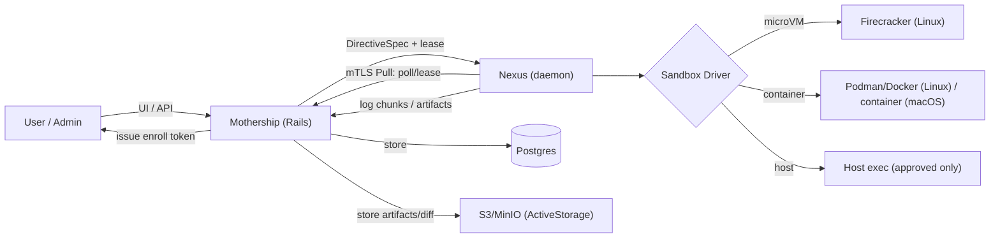

## 3. 总体架构

### 3.1 组件

- **Mothership（控制面子系统，位于 Cybros Monolith 内部）**
  - API：Nexus 注册/心跳、任务派发、日志/工件接收、facility/directive/policy 管理。
  - 调度：按 labels/capacity 选择 territory；对 facility 做亲和性调度。
  - 存储：PostgreSQL（元数据/状态 + log_chunks 分片表），ActiveStorage（diff blob）。
  - 鉴权（实现状态，Phase 0.5）：
    - Nexus：支持 `X-Nexus-Territory-Id`（dev-only）与 `X-Nexus-Client-Cert-Fingerprint`（来自受信边缘代理的 mTLS 终止层）；Phase 1+ 目标为 mTLS-only。
    - 用户侧 API：当前为测试 stub（`X-User-Id` header），Phase 2+ 再接入正式鉴权。

- **Nexus（执行面守护进程）**
  - 拉取任务（Pull），拿 lease，执行，上传结果。
  - 管理 facility（创建/锁/清理/配额）。
  - 选择 sandbox driver 执行：microVM / container / host。
  - 执行网络策略：none/allowlist/unrestricted（Untrusted 必须强制走代理；Linux 必须实现硬限制）。

### 3.2 数据面/控制面示意（Mermaid）

### 3.3 Monolith 组织方式（独立模块/namespace）

Mothership 以”强边界的内部模块”落在同一 Rails app 内：

- Ruby namespace：`Conduits`。执行子系统的模型（Territory/Facility/Directive）均位于该 namespace 下，表名使用 `conduits_` 前缀。全局模型（Account/User）不带 namespace。
- Rails 分层：
  - `app/models/conduits/*`（Territory/Facility/Directive 等）
  - `app/models/`（Account/User 等全局模型）
  - `app/controllers/conduits/v1/*`（Nexus 专用 API）
  - `app/jobs/conduits/*`（调度、超时、lease 回收、清理、轮换证书等）
  - `lib/conduits/*`（协议、策略引擎、校验器、Sandbox driver 抽象）
- 与 AgentCore 的依赖：
  - 第一阶段 **不依赖** AgentCore。
  - 最后集成时只增加适配层，把 AgentCore 的 tool calls 转换为 DirectiveSpec / Mothership API 调用（见第 12 节）。

### 3.4 Nexus API 的“多租户路径前缀”兼容

如果 Cybros 采用 URL path-based multi-tenancy（`/{account_id}/...`），Nexus API 建议放在 **不需要 account 前缀**的全局路径下，并在多租户 middleware 中白名单跳过，例如：

- `POST /conduits/v1/...`

理由：
- Nexus 通过 mTLS 身份可直接映射到 `territory_id`（再映射到 `account_id`），无需在 URL 中携带租户信息。
- 避免 Nexus 需要感知 `external_account_id`，减少配置复杂度与错误率。

---

## 4. 关键概念与数据模型（Mothership 子系统）

> Mothership 在 Monolith 内复用 Cybros 的 `Account/User/Role` 与多租户机制；从第一天起，所有 Mothership 表都按 `account_id`（必要时再加 `user_id`）做硬隔离，避免将来迁移成本爆炸。

### 4.1 Territory（执行节点）

- 表：`conduits_territories`
- 模型：`Conduits::Territory`
- 字段：
  - `id`（UUIDv7）
  - `account_id`（共享池场景才允许 NULL；默认要求归属租户）
  - `name`
  - `labels`（json，例如 `{"os":"linux","arch":"amd64","sandbox":["microvm","container"]}`）
  - `capacity`（json，最大并发、CPU/内存上限）
  - `status`（pending/online/offline/decommissioned）
  - `last_heartbeat_at`
  - `client_cert_fingerprint`（mTLS 身份）

### 4.2 Facility（持久工作区）

- 表：`conduits_facilities`
- 模型：`Conduits::Facility`
- 字段：
  - `id`（UUIDv7）
  - `account_id`
  - `owner_id`（→ users，工作区所有者）
  - `territory_id`（当前驻留 territory）
  - `kind`（`repo` / `empty` / `imported_path`）
  - `repo_url`（string，可选；**辅助性元数据 supplement**）
    - 当 `kind=repo` 且 `repo_url` 有值时，Nexus **可以**在 facility 首次使用时（目录为空）自动 clone，作为便捷的准备行为。
    - 但 `repo_url` 不是强制触发条件：聪明的 Agent 在发现空目录时，通常会自行 `git clone` 或在用户引导下准备环境。因此 `repo_url` 的定位是"提示 + 加速"而非"必要前置"。
    - 无 `repo_url` 的 `repo` 类型 facility 同样合法（Agent 或用户手动初始化）。
  - `root_handle`（opaque；控制面不直接存物理路径）
  - `size_bytes`（统计值，default 0）
  - `locked_by_directive_id`（互斥；应用层约束）
  - `retention_policy`（json，TTL、自动归档/清理）
- **Facility 准备阶段（prepare）**：
  - Nexus 在执行 facility 的首条 directive 之前，可执行 **prepare** 阶段：
    1. 若目录为空且 `repo_url` 有值 → 自动 `git clone`。
    2. 若目录为空且无 `repo_url` → 不做任何准备（等待 Agent / 用户手动初始化）。
    3. 若目录非空 → 跳过准备，直接执行。
  - prepare 阶段的网络权限继承 directive 的 `capabilities.net`（clone 操作需要网络访问）。
  - prepare 阶段失败不应静默：Phase 0.5 当前实现会在 stderr 写入 `[prepare] failed: ...`，并直接上报 `finished(status: "failed")`（不再执行用户命令）。
    - Future：可在 `started.effective_capabilities_summary` 中附带 prepare 摘要（更结构化），便于 UI 展示。
- **实现建议（按 profile）**：
  - Linux microVM（Untrusted）：`root_handle` 指向 block-backed ext4 镜像（或 volume），由 Nexus attach 给 microVM（宿主不直接 mount）。
  - Linux 容器（Trusted）：`root_handle` 指向宿主目录路径（Nexus 内部维护，不回传控制面）。
  - macOS（darwin-automation）：`root_handle` 指向宿主目录路径（workspace 目录）；默认仅允许访问该目录，访问其他路径必须进入审批流。

### 4.3 Directive（一次执行）

- 表：`conduits_directives`
- 模型：`Conduits::Directive`
- 字段：
  - `id`（UUIDv7）
  - `account_id`
  - `facility_id`（→ conduits_facilities）
  - `territory_id`（→ conduits_territories）
  - `requested_by_user_id`（→ users）
  - `approved_by_user_id`（→ users，可选）
  - `state`：`queued` → `leased` → `running` → `succeeded|failed|canceled|timed_out`
  - `requested_capabilities`（json）
  - `effective_capabilities`（json，最终生效能力，含审批结果）
  - `sandbox_profile`（untrusted/trusted/host，default "untrusted"）
  - `command`（**string**，shell 命令；Mothership 在创建 directive 时包装，LLM 不直接输出 JSON）
  - `shell`（string，可选，默认 `/bin/sh`；所有平台统一）
  - `cwd`（默认 `/workspace`）
  - `env_allowlist`（json） + `env_refs`（json，secrets 引用）
  - `timeout_seconds`（default 0）
    - Phase 0.5 用户侧创建 directive 时，若未显式传入 `timeout_seconds`，当前实现默认使用 300 秒（见 `mothership/app/controllers/mothership/api/v1/facility_directives_controller.rb`）。
  - `limits`（json，cpu/mem/disk/max_output_bytes/max_diff_bytes 等）
  - `runtime_ref`（json）：记录用于回放的运行时引用（容器镜像 digest / microVM kernel+rootfs digest）
  - `egress_proxy_policy_snapshot`（json）：本次 directive 生效的 allowlist 规则快照（便于审计）
  - `exit_code`
  - `stdout_truncated` / `stderr_truncated` / `diff_truncated`
  - `snapshot_before` / `snapshot_after`（string，可选；repo facility 的快照标识，Phase 0.5 由 Nexus 上报，Mothership 仅存储）
  - `artifacts_manifest`（json：对象存储 key、大小、hash）
  - `diff_blob`（ActiveStorage 引用，大文件存对象存储）
  - `stdout_bytes` / `stderr_bytes`（累计字节数；服务端强制 `max_output_bytes`）
  - `conduits_log_chunks`（stdout/stderr 分片表；`(directive_id, stream, seq)` 唯一键去重）
  - `nexus_version` / `sandbox_version`
  - `lease_expires_at` / `last_heartbeat_at`
  - `result_hash`（string；Phase 0.5：`finished` payload canonicalize 后的 SHA256，用于幂等校验与检测“重复上报但内容不一致”的 bug）

### 4.4 Policy（策略）

- 表：`conduits_policies`
- 模型：`Conduits::Policy`
- 作用域（自上而下覆盖）：
  - global default → account → user → facility → directive override
- 内容（jsonb）：
  - `fs`：允许 read/write 的路径集合（默认仅 facility workspace 目录）
  - `net`：none/allowlist/unrestricted + allowlist entries
  - `secrets`：可用 secret refs
  - `sandbox_profile_rules`：哪些条件下允许 trusted/host
  - `approval`：哪些能力需要人工审批

---
