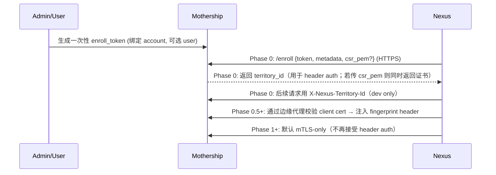

## 5. 执行 Profile（用户可理解的安全层级）

> 说明：profile 是“安全承诺 + 能力边界 + 审批/审计要求”的组合。不同 OS 上实现路径不同，但对用户暴露的语义必须一致、可解释、可审计。

### 5.0 Phase 0（开发可用，但不提供隔离承诺）

> Phase 0 的目标是跑通 enroll → poll/lease → execute → upload logs → finish 的最小闭环。
> **Phase 0 的 Nexus 只实现 `host` driver（无隔离）**：不提供 OS 级强制边界；`sandbox_profile`/`capabilities` 目前主要用于协议联调与审计占位。
>
> 因此：
> - Phase 0 仅适用于**你完全信任的开发机/测试机**（单租户、自用）。
> - 任何“不可信代码执行”的安全承诺都要等 Phase 1（bubblewrap）/Phase 3（microVM）落地后才成立。

### 5.1 Untrusted（默认，仅 Linux）

- 适用：未知仓库/未知脚本/来自用户输入的不可信代码。
- 目标：把逃逸风险降低到”需要突破沙箱边界”。
- Linux 实现（分阶段）：

  **Phase 1（MVP）：bubblewrap namespace 隔离**（决策 D11）
  - 使用 [bubblewrap (bwrap)](https://github.com/containers/bubblewrap) 创建隔离环境：
    - **Mount namespace**：全新 tmpfs root，显式 bind-mount 必要路径。
    - **Network namespace**：完全隔离（仅 loopback），出站流量通过 Unix socket 连接宿主 egress proxy。
    - **PID namespace**：隐藏宿主进程，内置 init 处理僵尸进程回收。
    - **User namespace**：限制只能看到当前 uid/gid。
    - `PR_SET_NO_NEW_PRIVS` 阻止 setuid 提权。
  - 文件系统默认策略（建议修订决策 D12）：
    - **Untrusted 默认“workspace-only”**：只把 facility workspace 挂载进沙箱；其它宿主路径默认不可见（减少“deny 敏感路径列表”维护成本与遗漏风险）。
    - **Write = allow-only**：默认阻断所有写入，仅显式允许 workspace（或 policy 明确允许的路径集合）。
    - **Read-open（可选，仅 Trusted/Host）**：参考 Claude Code 的“Read=open-by-default, Write=closed-by-default”更易用，但边界更弱；如引入，应作为显式开关并配合审批/审计，而不是 Untrusted 默认。
  - 网络强制通过 egress proxy（见第 7 节），在沙箱 namespace 层面实现硬隔离。
  - 优势：无需 KVM，轻量（< 50ms 启动），适合 MVP 快速验证。
  - 依赖：`bubblewrap` + `socat`（Ubuntu: `apt install bubblewrap socat`）。

  **Phase 3+（增强）：Firecracker microVM（KVM）**
  - 在 bwrap 基础上可选升级为 Firecracker microVM，提供硬件虚拟化级别隔离。
  - facility 使用 **block-backed ext4 镜像/volume** attach 给 microVM（virtio-blk），在 guest 内 mount 到 `/workspace`。
  - 需要 KVM 支持（`/dev/kvm`）。
  - 适用场景：共享多租户环境、需要最高隔离级别。

- macOS：**不提供 Untrusted**。如果用户确实需要隔离执行（构建/测试/脚本/抓取），产品策略是引导其使用 Linux territory（物理机/服务器/VM/容器）。

- **双层防御模型**（决策 D13，参考 Claude Code）：
  - **Policy 层**（Mothership）：在逻辑层控制能力组合（net/fs/secrets/approval）。
  - **OS 层**（Nexus sandbox）：在物理层强制执行（namespace/proxy/权限）。
  - 即使提示词注入绕过了逻辑层的决策，OS 层仍阻断越界访问。

### 5.2 Trusted（显式标记，仅 Linux）

- 适用：开发者自用、已知可信仓库、或用户明确允许“更弱隔离换更好体验”。
- Linux 实现：
  - rootless Podman 优先（减少宿主权限暴露）。
  - 允许网络 allowlist/unrestricted（策略控制；但注意容器模式下“硬限制”能力较弱，仍建议默认走 egress proxy 做审计与提示）。

### 5.3 Host（高危，仅显式审批；优先 Linux）

- 适用：确实需要宿主能力（访问企业内网/VPN、访问真实设备、访问宿主文件系统的非 workspace 路径等）。
- 约束：
  - 仅允许“个人 Nexus（绑定 user）”开启（避免在共享机器上误用）。
  - **每次 directive 必须审批**（展示命令、cwd、可读写路径、网络策略、secrets）。
  - 文件访问必须明确路径 allowlist（禁止 `~` 全量、禁止 `/`）。
- 备注：Host 的安全承诺主要来自“审批 + 审计 + 最小权限”，而不是隔离。

### 5.4 darwin-automation（高危，仅 macOS；仅显式审批）

- 适用：需要操作 macOS 原生应用（GUI/Automation、Shortcuts、AppleScript、UI Automation），例如“像 OpenClaw 那样操作各种软件达成目的”。
- 安全边界（必须写在产品文案里）：
  - **不提供隔离**（等价于 Host 能力），因此 **禁止运行不可信任意代码**。
  - 默认 `NET=NONE`；如需联网必须走审批，并尽量通过代理/审计方式约束。
  - 默认只允许 workspace 路径；访问 Desktop/Documents/Downloads 等敏感目录必须单独审批。
- 权限（TCC）：
  - 需要用户在系统设置中授权 Automation（Apple Events）、Accessibility、Screen Recording 等。
  - 企业设备可通过 PPPC profile（MDM）进行预授权，否则只能由用户交互授权。

### 5.5 产品策略（定稿）

- macOS：只做 `darwin-automation`，把“macOS 能做什么/不能做什么”说清楚，避免为了兼容而牺牲隔离承诺。
- 需要隔离执行（容器/microVM）的用户：直接使用 Linux territory；若用户坚持在 macOS 上运行隔离执行，则建议用户自建 Linux VM/远程 Linux 机器并把 Nexus 安装在 Linux 上接入。

### 5.6 Policy 合并语义（Per-Capability 独立规则）

> 当多条 Policy 同时生效（global → account → user → facility）时，按 capability 类别分别合并。

| Capability | 合并策略 | 说明 |
|------------|---------|------|
| `net`（网络） | **Restrictive ceiling**（交集） | 安全敏感，越细粒度越严格。global 允许 + account 禁止 = 禁止。 |
| `fs`（文件系统） | **Restrictive ceiling**（交集） | 同上，路径取交集。 |
| `secrets` | **Priority replace**（高优先级覆盖） | secret 引用是精确匹配，不适合交并。facility 级覆盖 account 级。 |
| `sandbox_profile_rules` | **Priority replace** | 沙箱配置是完整 profile，不做部分合并。 |
| `approval` | **Most restrictive wins** | 任意一条 policy 要求审批，则必须审批。 |

实现时在 `Conduits::Policy` 上添加 `#effective_for(directive)` 方法，按上述规则合并。

### 5.7 Secret 传递方式

> 参考 NanoClaw：secret 绝不写入文件系统，只通过 stdin 或 tmpfs 注入。

- **Nexus 从 Mothership 获取 secret 值**时，仅在内存中持有，不写磁盘。
- **注入 sandbox**：
  - 优先方式：通过 **stdin pipe** 传递（NanoClaw 模式）。
  - 备选方式：写入 **tmpfs**（`/run/secrets/<ref>`），directive 结束后立即清除。
  - **禁止**：通过环境变量注入（容易被子进程泄漏、日志记录、crash dump 暴露）。
- **防泄漏**：Nexus 在 stdout/stderr 上传链路中做 redaction（扫描 PEM 头、已知 token 前缀等）。

---

## 6. Nexus 注册与安全通道（mTLS + Pull）

### 6.1 为什么 Pull

- Nexus 只需要出站访问 Mothership（HTTPS），无需在企业内网机器开放端口。
- NAT/防火墙友好；断线重连简单；可统一限流与审计。

### 6.2 注册（Enrollment）流程

要点：
- enroll token **一次性**、短 TTL、可撤销。
- mTLS 客户端证书可轮换（Nexus 定期刷新；控制面可吊销）。
- 推荐在 Mothership 前置反向代理（Caddy/Nginx/Traefik）终止 TLS 并校验客户端证书；将 nexus identity 以受信 header 传给 Rails（Rails 只信任来自本地代理的 header）。

#### 6.2.1 Phase 0 Territory 认证范围（MVP，先跑通闭环）

> 决策 D16：为了让 Rails/Mothership 与 Go/Nexus 可并行开发，Phase 0 先用 header auth 跑通闭环；mTLS CA/签发/校验可作为独立工作流推进。

Phase 0 范围（最小可行）：
- Enrollment 仍使用一次性 `enroll_token`（短 TTL，一次性）。
- enroll 成功返回 `territory_id`。
- Nexus 后续请求使用 `X-Nexus-Territory-Id` header 标识 territory（**可伪造，dev only**）。
- Directive 级别操作使用 `Authorization: Bearer <directive_token>`（短 TTL，绑定 directive_id/territory_id）。
- 目标：跑通 enroll → poll/lease → started/heartbeat/log_chunks/finished 的闭环，并让协议/数据模型可独立演进。

Phase 0.5（已实现，mTLS MVP）：
- enrollment 可选携带 `csr_pem`：
  - Mothership 基于内置 CA 签发 client cert，并把其 **DER 的 SHA1 指纹**写入 `territory.client_cert_fingerprint`。
  - 返回 `mtls_client_cert_pem` 与 `ca_bundle_pem` 供 Nexus 保存与后续握手使用。
- territory 认证支持“证书指纹 header → territory_id”映射：
  - 依赖边缘代理（Caddy/Nginx/Traefik）终止 TLS 并校验 client cert，然后把指纹注入到受信 header（默认 `X-Nexus-Client-Cert-Fingerprint`）。
  - Rails 侧通过 `CONDUITS_TERRITORY_AUTH_MODE=header|mtls|either` 控制接受方式；生产建议设为 `mtls` 并确保 Rails 只能被代理访问（否则 header 可被伪造）。
  - 指纹规范化：忽略大小写与 `:`（例如 `AA:BB:...` 与 `aabb...` 等价）。
- 现状边界：
  - 证书轮换/吊销（CRL/denylist）尚未实现。
  - CA 私钥当前存储在 `mothership/storage/conduits/mtls/ca.key`（原型阶段可用；生产应迁移到受控 secret 存储并支持轮换）。

Phase 1+ 增强（按需推进）：
- 默认切到 mTLS-only（禁用 header auth）。
- 证书自动轮换（Nexus 定期 re-enroll）。
- CRL/denylist 吊销机制。
- 反向代理终止 TLS 并传递客户端证书指纹。
- macOS Keychain 安全存储 / Linux systemd credentials。

### 6.3 Nexus 与 Mothership 的认证边界

- Nexus 身份：由 mTLS 客户端证书唯一确定（映射到 `territory_id`）。
- 每个 Directive 另发 **短期 directive_token**（JWT，scope=directive_id，TTL=分钟级）用于上传日志/工件，降低横向风险。

### 6.4 Nexus 最小权限模型（新增，建议写进实现）

> 目的：把“必须 root 才能干的事”收敛到最小范围，降低 Nexus 被利用的风险。

- Linux（建议）：
  - Nexus 主进程尽量以非 root 用户运行（systemd service + NoNewPrivileges）。
  - 需要特权的能力（KVM、tap/iptables/nft、挂载 block device）通过：
    - 单独的 root helper（最小命令集、参数严格校验），或
    - systemd 动态能力授权（CapabilityBoundingSet），配合严格的文件权限与审计。
  - Firecracker 建议使用 `jailer` 运行，确保每个 microVM 在独立 cgroup/namespace 下、并做 chroot/jail。
- macOS：
  - `container` 安装与 system service 可能需要管理员权限；Nexus 仍尽量不长期持有 root 权限。
  - Host Automation 必须显式开启，并且在 UI 侧持续提示“高危模式”。

---
